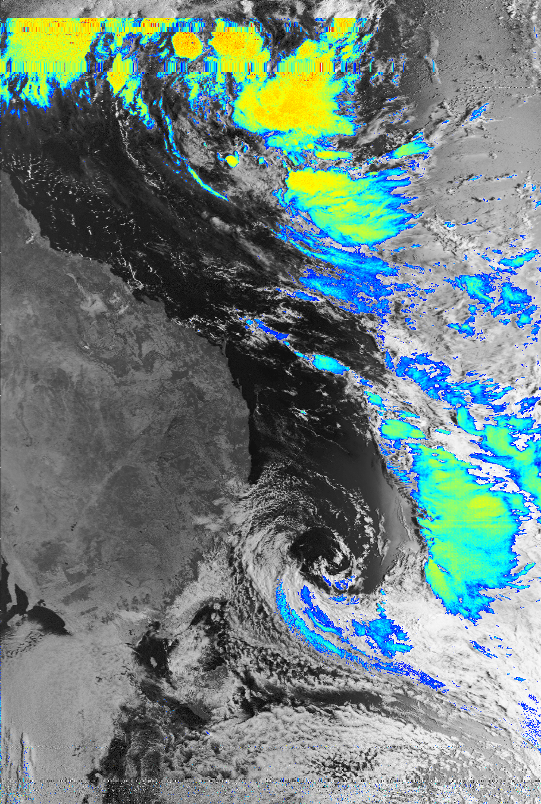
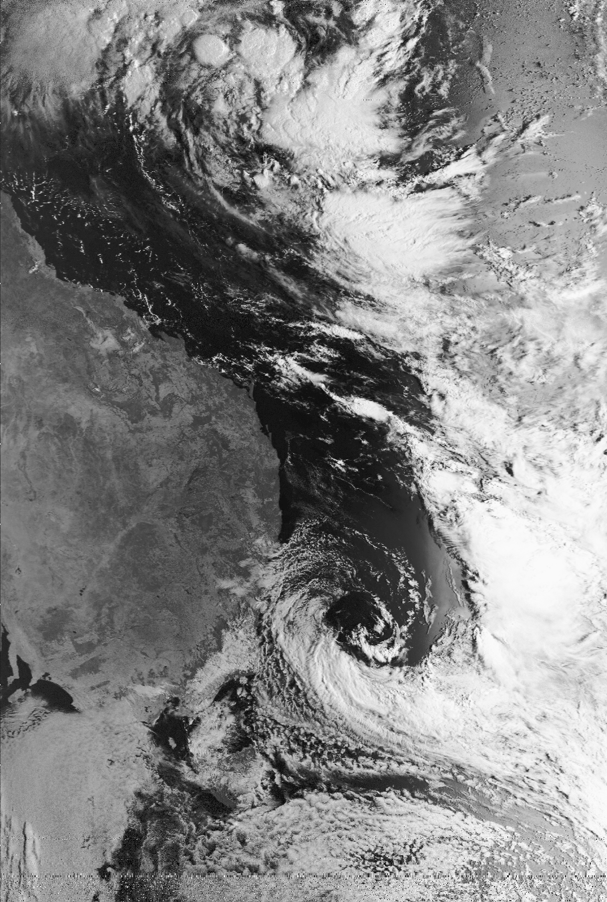
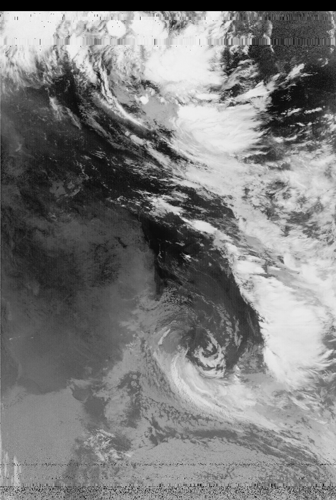

# APT Proc
Process images from NOAA APT sattelite broadcasts.

## Setup
```bash
# Install Dependencies
pip install Pillow

python3 apt_proc.py <input_image> <output directory>
```


## Supported processors
|Name|Status|
|----|------|
|Noise patch|Stable|
|Rainfall 🌧|Stable|


## Results

### Rainfall


### Visible


### Thermal

